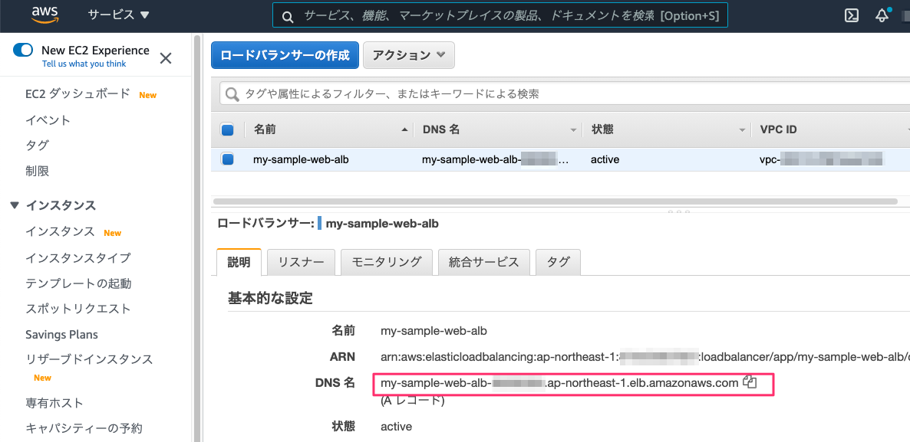
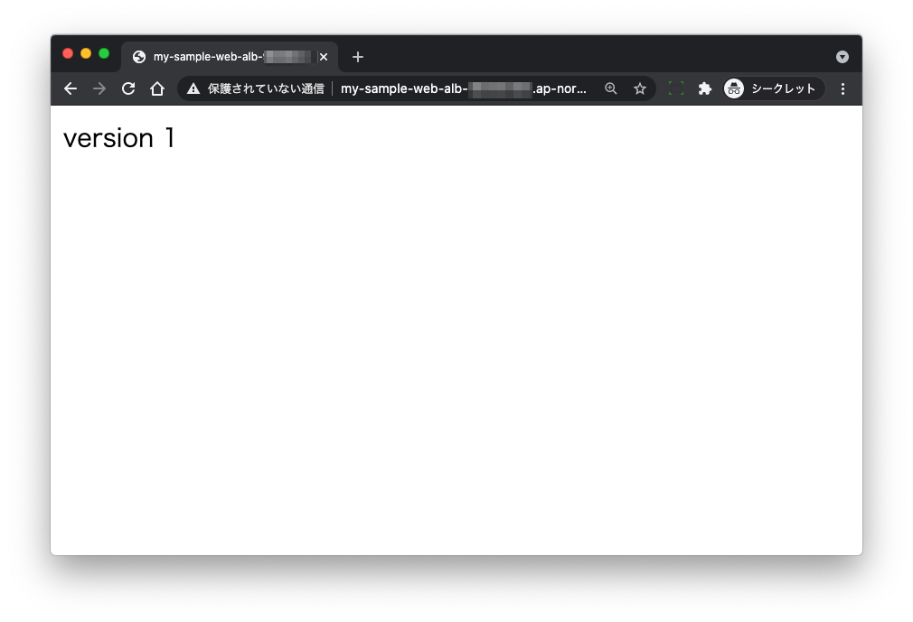
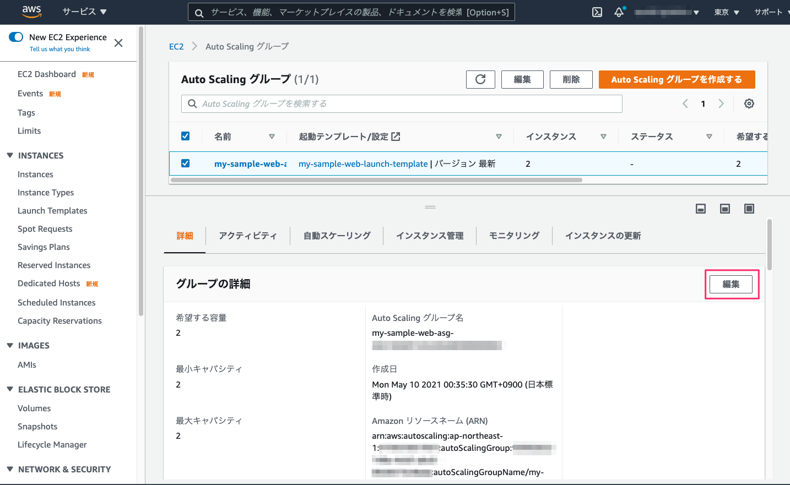
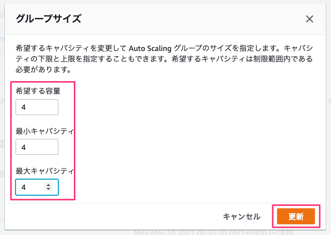
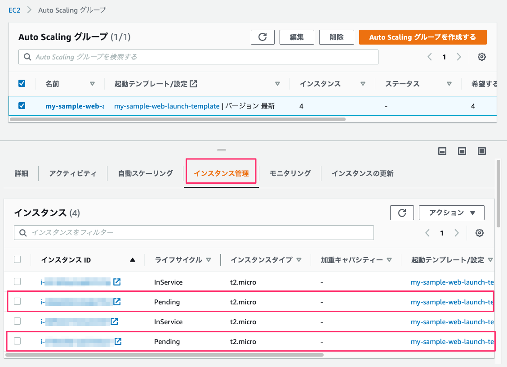
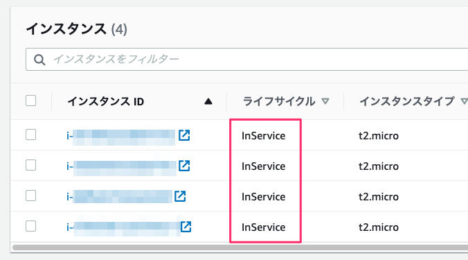
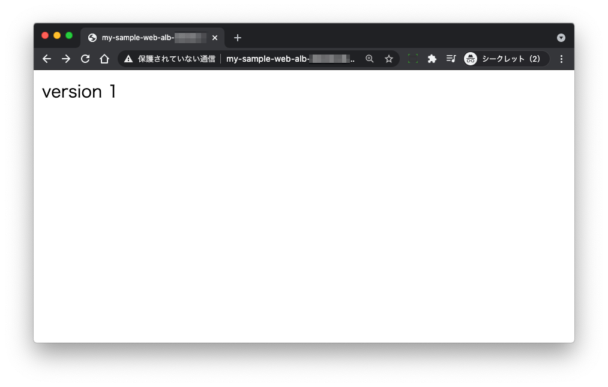
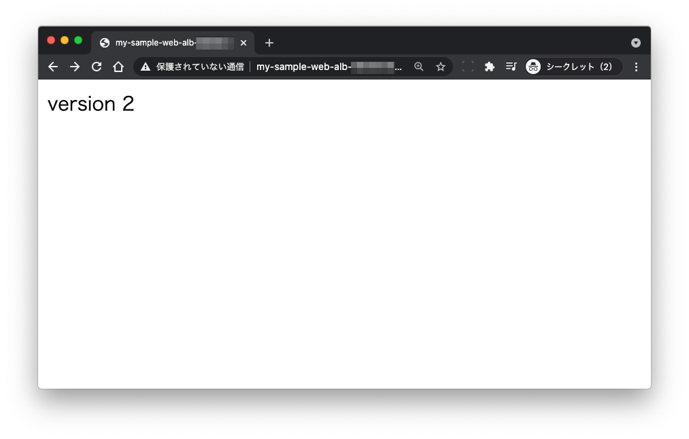
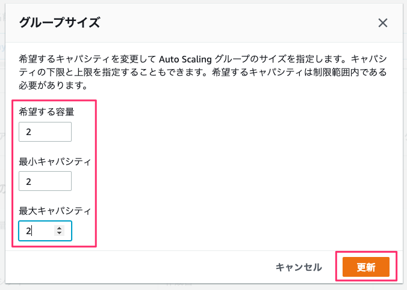

# packer-terraform-aws-blue-green-deployment-sample

Packer/Terraformを使って、AWS AMIをベースにしたblue/green deploymentを行うサンプル

## Usage

### レピポジリのクローン

```
git clone https://github.com/kun432/packer-terraform-aws-blue-green-deployment-sample
cd packer-terraform-aws-blue-green-deployment-sample
```

### Packer 

#### AMIの作成

packerディレクトリに移動

```
cd packer
```

variables.pkr.hclを変更。"my"を自分の名前に変更。

```
variable "stage" {
  default = "my"
}
```

webサーバAMIを作成

```
packer init .
packer validate .
packer build .
```

AMI IDが表示されるのでメモっておく

元のディレクトリに戻る

```
cd ..
```

### Terraform

#### tfstate用S3バケットの作成（初回だけ）

terraformディレクトリに移動

```
cd terraform
```

まずTerraformの状態間利用ファイル（tfstate）の保存用S3バケットを作成してバージョニングを有効化しておく。バケット名（myの部分）は適宜変更。

```
aws s3 mb s3://my-pkr-tf-bg-deploy-sample --region ap-northeast-1
aws s3api put-bucket-versioning --bucket my-pkr-tf-bg-deploy-sample --versioning-configuration Status=Enabled
aws s3api get-bucket-versioning --bucket my-pkr-tf-bg-deploy-sample
```

#### AWSリソースの構築

環境ごとのディレクトリに移動（サンプルではdevelopmentだけ。たとえば、developmentをコピーしてstaging/productionを作れば、環境ごとに作り分けることができる）

```
$ cd envs/development
```

backend.tfを変更。"my"を上記で作成したS3バケットに合わせて修正。

```
terraform {
  backend "s3" {
    bucket = "my-pkr-tf-bg-deploy-sample"
    key    = "terraform.tfstate"
    region = "ap-northeast-1"
  }
}
```

variables.tfを2箇所変更。

"my"を自分の名前に変更。

```
(snip)

variable "stage" {
  default = "my"
}

(snip)
```

packerで作成したAMI IDに変更

```
(snip)

variable "web_ami_id" {
  default = "ami-XXXXXXXXXXXXXXXXX"
}

(snip)
```

適用

```
# initで初期化（モジュールのダウンロード・インストール、S3バケットに状態管理ファイルが用意される）
$ terraform init

# dry-run
$ terraform plan

# 適用
$ terraform apply
```

作成されたら、マネジメントコンソールで「EC2」->「ロードバランサー」を開き、DNS名を参照、ブラウザでアクセスできることを確認する






元のディレクトリに戻る

```
cd ../../..
```

### blue/green deployment

#### AMIのリビルド

packerディレクトリに移動

```
cd packer
```

build.pkr.hclの以下の部分を修正（"version 1"から"version 2"にする）

```
  provisioner "shell" {
    inline = [
      (snip)
      "echo 'version 2' | sudo tee /var/www/html/index.html",
      (snip)
    ]
  }
```

再度AMIを作成

```
packer validate .
packer build .
```

AMI IDが表示されるのでメモっておく

元のディレクトリに戻る

```
cd ..
```

#### 起動テンプレートの変更

terraformディレクトリに移動

```
cd terraform 
```

環境ごとのディレクトリに移動

```
$ cd envs/development
```

variables.tfを変更。 packerでリビルドしたAMI IDに更新

```
(snip)

variable "web_ami_id" {
  default = "ami-XXXXXXXXXXXXXXXXX"
}

(snip)
```

適用

```
# dry-run
$ terraform plan

# 適用
$ terraform apply
```

適用後、マネジメントコンソールを開く

「EC2」->「オートスケーリンググループ」でインスタンス数を倍にする





しばらくするとインスタンスが追加される。"Pending"中はまだ追加されない。



すべて"InService"になったら、ブラウザでアクセスしてみる。何度かリロードすると、置き換え前AMIで起動しているものと、置き換え後AMIで起動しているものが、両方動いている。







台数をもとに戻す



台数が減る。このとき古いAMIから起動しているものが削除される（正しくは、AMIを更新すると起動テンプレートのバージョンが上がる。古いバージョンの起動テンプレートで起動したものから削除される）


ブラウザでアクセスしてみると、置き換え後AMIで起動しているものしか動いていないのがわかる。


### 削除

※VPCエンドポイント作ってるので、ほっとくと結構課金されます。

#### terraform

```
cd terraform
cd envs/development
terraform destroy
```

#### packer

マネジメントコンソールから、

- AMIの削除
  - このとき、AMI IDを控えておく
- EBSスナップショットの削除
  - 上記のAMI IDに紐付いたスナップショットを削除

